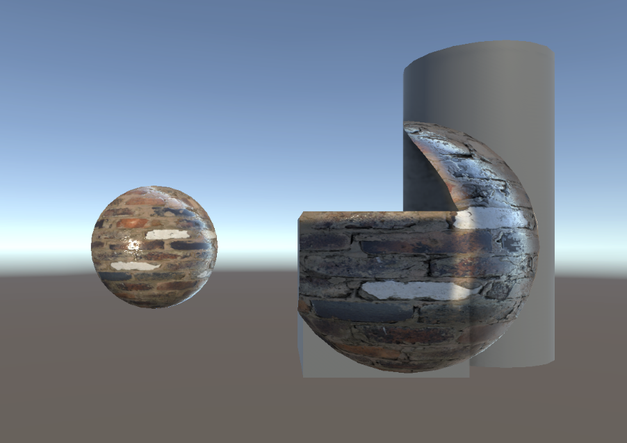

# はじめに
プログラムワークショップⅣの5つ目の管理用です

# 結果画像

- 工夫した点：ZtestをGreaterにして他のオブジェクトと重なった部分だけ描画するようにしました

# 進め方

- 本リポジトリ (tpu-game-2025/PGWS4_5)をforkしてください
- fork先のリポジトリを更新してください
- Unityのプロジェクトをsrc内で進めてください
- 結果を画面キャプチャして、画像としてリポジトリに追加して、上記のリンクから見られるようにしてください
- 完成したら本リポジトリのmainブランチにpull requestを投げてください
